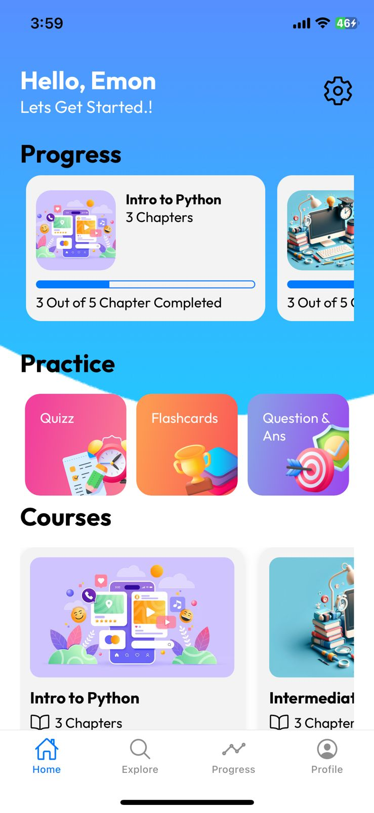

# 🎓 Coaching Guru - A Learning App

A comprehensive mobile application built with React Native and Firebase, designed to provide an engaging learning experience with course exploration, progress tracking, and content creation features.
## Preview
  

--


## Demo Credentials for testing app
   email: test@mail.com

   pass: asdfghjkl

## Get started

### Clone the repository
```bash
git clone https://github.com/mr-rafiqul-islam/coaching-guru-mr-rafiqulthedev.git
```

### Navigate to project directory
```bash
cd coaching-guru-mr-rafiqulthedev
```

### 1. Install dependencies

   ```bash
   npm install
   ```

### 2. Start the app

   ```bash
   npx expo start
   ```
### 3. Install the Expo Go App on your Phone :
   -> open the camera or app to scan the QR code from the terminal.

#### Or (Alternative of 3) 
In the output, you'll find options to open the app in a

- [development build](https://docs.expo.dev/develop/development-builds/introduction/)
- [Android emulator](https://docs.expo.dev/workflow/android-studio-emulator/)
- [iOS simulator](https://docs.expo.dev/workflow/ios-simulator/)
- [Expo Go](https://expo.dev/go), a limited sandbox for trying out app development with Expo

You can start developing by editing the files inside the **app** directory. This project uses [file-based routing](https://docs.expo.dev/router/introduction).


